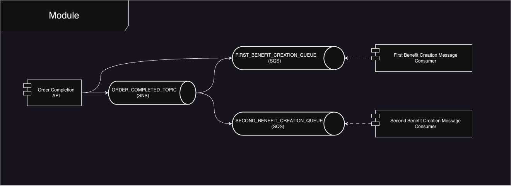

# aws-sns

### 개발환경
- Spring Boot 3.1.0
- Spring Cloud AWS 3.0.1 
- Spring Cloud OpenFeign 4.0.3
- Spring Data Jpa & QueryDsl
- Java 17
- H2

### API

[더미 주문 완료]
- PATCH http://localhost:8080/v1/orders/{orderId}/completion
    - -H ContentType: application/json
    - orderId : 임의의 값

[First Benefit 조회]
- GET http://localhost:8060/v1/first-benefits
  - query parameters
    - userId : testUserId

[Second Benefit 조회]
- GET http://localhost:8070/v1/second-benefits
  - query parameters
    - userId : testUserId

### 테스트 시나리오 
1. 더미 주문 완료 API를 호출한다.
   * SNS 발송 (First Benefit 등록 큐와 Second Benefit 등록 큐가 구독 중인 Topic)
   * SQS 발송 (First Benefit 등록 큐)
2. First Benefit 목록을 조회한다.
   * userId는 testUserId로 고정 값이다.
   * 한 번 더미 주문이 완료 됐을 때, First Benefit은 두 건이 등록된다.
3. Second Benefit 목록을 조회한다.
   * userId는 testUserId로 고정 값이다.
   * 한 번 더미 주문이 완료 됐을 때, Second Benefit은 한 건이 등록된다.
